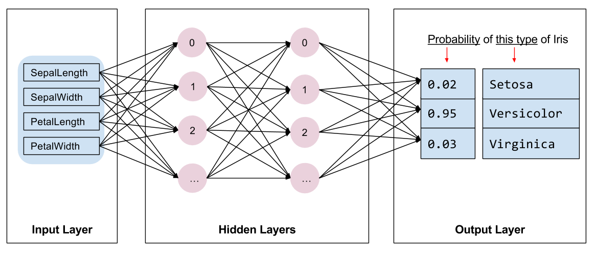

# First TensorFlow application

Mise à jour de TensorFlow :  pip install tensorflow --upgrade

Invocation du programme : python my_first_estimator.py --batch_size=200 --train_steps=200

Getting started : https://www.tensorflow.org/get_started/premade_estimators

## The Tensorflow programming stack

## The Deep Neural Network classifier model

## Entraîner un modèle

Méthode "train" du classifieur/ Réseau de neurones DNNClassifier :

train(input_fn,hooks=None,steps=None,max_steps=None,saving_listeners=None)

input_fn : Fonction qui fournit les données (Datasets) sous forme de Tuples (features, labels) en entrée pour l'apprentissage en mode minibatchs

steps : Nombre d'étapes pour lesquels on entraîne le modèle. Si NONE alors on entraîne jusqu'à ce que la fonction input_fn génère une erreur "OutOfRange" ou une exception "StopIteration". 

max_steps : Nombre total d'étapes pour lesquels on entraîne le modèle. Si renseigné, alors steps = NONE
Si steps = 100, alors 2 appels à train signifie 200 itérations
Si max_steps = 100, alors 2 appels à train signifie 100 itérations

